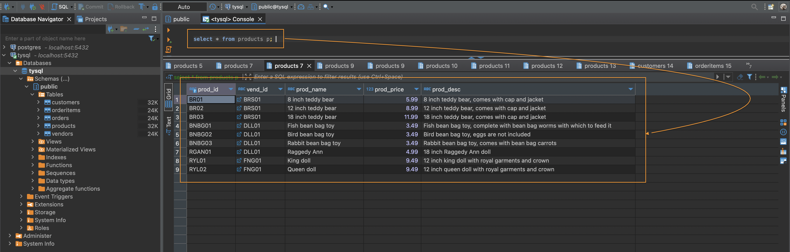

## Lesson 2: Retrieving Data
 

### **The `SELECT` Statement**

1. Every SQL statement is made up of one or more **keywords**.
2. **Keyword**
   1. A reserved word that's part of SQL language.
   2. Cannot name a table or column using a keyword.
3. `SELECT` retrieves table data by specifying two pieces of information:
   1. What you want to `SELECT`.
   2. From where you want to `SELECT` it.
 

### **Retrieving Individual Columns**

**Example 1**:
- This query retrieves a single column from the table. 
- Data is not filtered nor sorted.
   

1. **Unsorted Data**
   1. Data will display in different orders if not explicitly sorted. 
2. **Terminating Statements**
   1. Multiple queries must be separated by semicolons (may not always be needed depending on the DBMS).
3. **SQL Statement and Case**
   1. SQL statements are *not* case sensitive.
   2. Names of tables, columns, and values may not be. 
4. **White Space**
   1. All extra white space within a SQL statement is ignored when it is processed.
   2. Easier to read and debug when breaking up statements over multiple lines.
   3. Example below:

 

### **Retrieving Multiple Columns**

**Example 1**:
- This query is retrieving three columns (separated by commas) from the table.

1. **Presentation of Data**
   1. Statements return unformatted data and different DBMS may display data differently (different alignments or decimal places).
   2. Data formatting is a presentation issue, not a retrieval issue.
   3. Presentation is specified in the application that displays the data.
   4. Actual retrieved data (without application-provided formatting) is rarely used.
 

### **Retrieving All Columns**

1. **Using Wildcards ( * )**
   1. Used to request all columns without having to list then individually.
   2. Column order will typically be the physical order in the table definition.
2. **Retrieving Unknown Columns**
   1. Using a **wildcard ( * )** will retrieve unknown cards.

 

### **Retrieving Distinct Rows**

**Example 1**:
- Using `DISTINCT` keyword before the column name in a query will return unique rows.
- `DISTINCT` keyword applies to all columns that are specified.

 

### **Limiting Results**

1. **`LIMIT` Clause**
   1. Keyword specific to PostgreSQL.
   2. Specifies the number of rows to return.
2. **`OFFSET` Clause**
   1. Keyword that specifies which row to start from.
3. **Row `0` Caution**
   1. The first row retrieved is row `0`, not row `1`.

 

### **Using Comments**

1. **Comments**
   1. Texts that are not processed and executed.
   2. Include descriptive comments when your queries grow in length and complexities.
   3. Can also be used to debug and stop parts of the query when *comment out*.
   4. `--` is an inline comment.
   5. `/* */` is a multiline comment.

 

### Challenges

