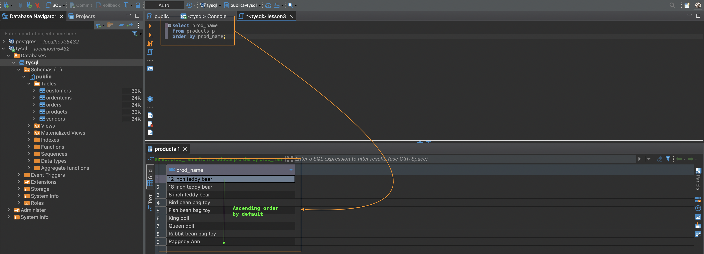

## Lesson 3: Sorting Retrieved Data
 

### **Sorting Data**

1. Unsorted data will typically display in the order in which it appears in a table, which could be the order in which the data was added to the table initially.
2. You cannot rely on the sort order if you do not control it.
3. Relational DB Design theory states that the sequence of retrieved data cannot be assumed to have significane if ordering was not explicitly specified.
4. **Clause**
   1. SQL statements are made up of clauses (required or optional).
   2. A clause consists of a keyword and supplied data.
5. `ORDER BY`
   1. Takes the name of one or more columns by which to sort the output.
   2. Be default, it sorts by ascending order and it is not necessary to type that out.
6. **Position of `ORDER BY` Clause**
   1. When specifying an `ORDER BY` clause, it needs to be the last clause in the `SELECT` statement.
7. **Sorting by Nonselected Columns**
   1. More often than not the columns used in an `ORDER BY` clause will be the ones selected for display, it is ***not required* to sort data by a column that is not retrieved***.

 

### **Sorting by Multiple Columns**

1. When sorting multiple columns, the sort sequence is exactly as specified. 
2. **Sorting sequence** starts from the first column listed after `ORDER BY` then by each subsequent column afterwards.
3. `DESC`
   1. Sorts by descending order.
   2. Its placement is after the column name.
   3. Must add keyword after each column name if you want multiple columns in descending order.

 

### **Sorting by Column Position**

1. You can use relative column position, rather than column name, for the `ORDER BY` clause.
2. Advantage is saving time on retyping column names, but can be easier to make mistakes.
3. Can only be used with columns listed in the `SELECT` statement.
4. **Sorting by Nonselected Columns**
   1. You can mix and match column names and relative position in a single statement.

 

### **Specifying Sort Direction**

1. **Sorting Descending on Multiple Columns**
   1. Make sure each column has its own `DESC` keyword that directly secedes it.

 

### **Challenges**

